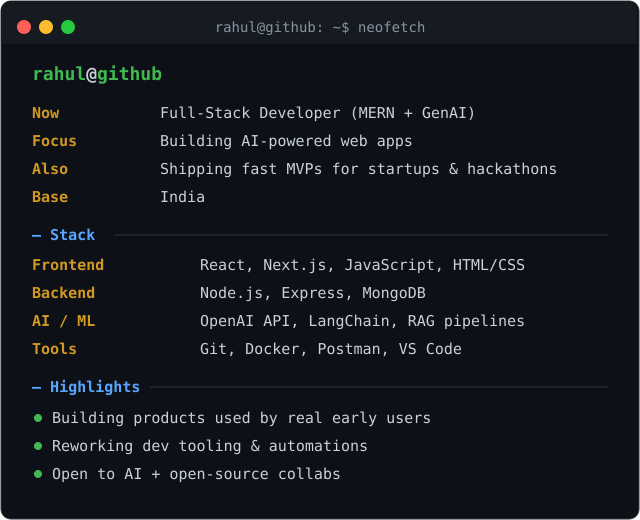

# Rahul Arora

### Full Stack Developer • AI Enthusiast • Cloud & DevOps Learner

Building practical software, exploring AI, and growing through open source.

  

---

## About

  

---

##  GitHub Analytics

---

##  Connect

**Portfolio**  
https://iam-rahularora.me

**LinkedIn**  
https://www.linkedin.com/in/createsrahul/

**Email**  
createsrahul@gmail.com

